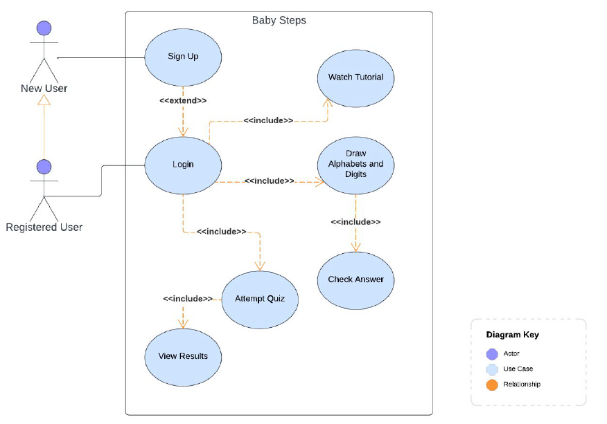
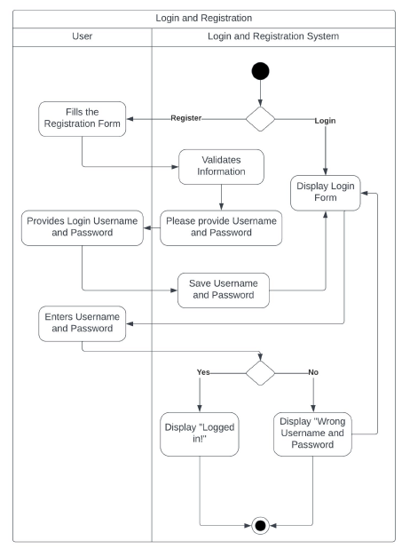
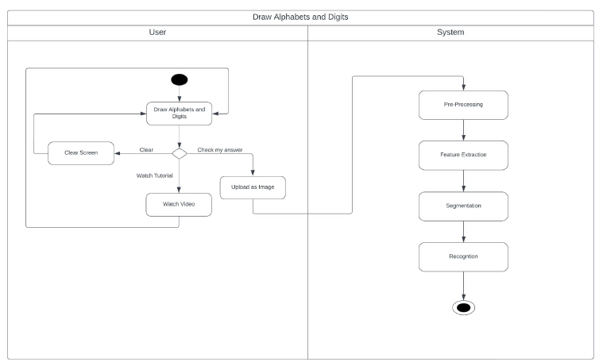
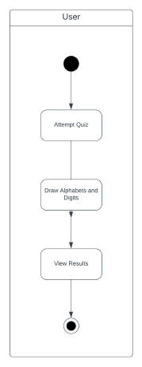
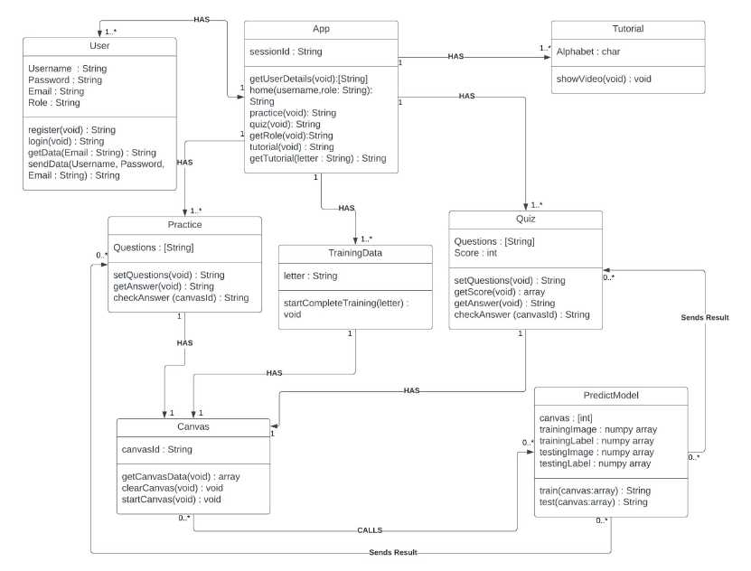
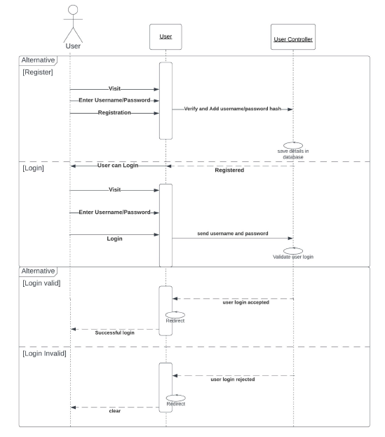
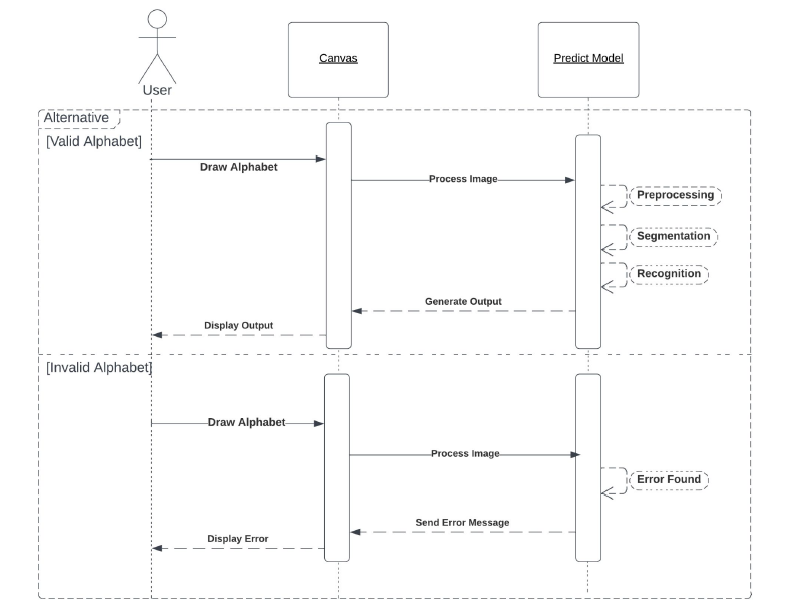
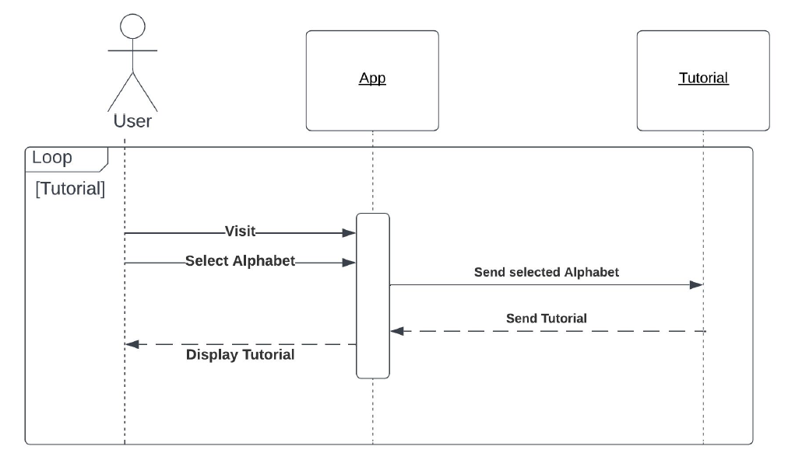

# Baby Steps
#### _Learning writing made easier_

## About This Project
This project was developed as part of the Object Oriented Design course. It showcases the application of object-oriented principles and design patterns learned during the course.

## Description
- In the era of digitalization, the vision of Baby Steps is to help preschoolers learn how to write alphabets and numbers in an easy-to-use and rewarding method.
- The application aims to make learning accessible to all children.
- The objective is to create a global learning tool seated at the cross-section of technology, interactive content, and personalized learning methods to help children become active self-learners.

[Watch the demo video](BabyStepsVideo.mp4)
## Diagrams
### Use Case Diagram

### Activity Diagrams:
##### Login/Signup Use Case

##### Draw Alphabets and Digits, Check Answers and Watch Tutorial Use Cases

##### Attempt Quiz Use Case

### Domain Model

### Sequence Diagrams:
##### User Registration and Login

##### Draw Alphabets and Digits

##### Attempt Quiz and View Results

##### Watch Tutorial

## Project Architecture (Frameworks, Packages, and Tools)

- **Language:** Python
- **Web Framework:** Flask - For creating web applications.
- **Development Environment:** JupyterLab - Helps illustrate the analysis process step by step.
- **Machine Learning Library:** TensorFlow - Used for training and testing models. Keras, running on top of TensorFlow, provides functionality for working with deep neural networks.
- **Data Visualization:** Seaborn - Based on Matplotlib for creating statistical graphics.
- **Machine Learning Toolkit:** Scikit-learn - Utilized for evaluating the accuracy of a classification with confusion matrix functionality.
- **Numerical Computing:** NumPy - Provides high-performance multidimensional array objects and tools for working with these arrays.
- **Plotting Library:** Matplotlib - Used for creating visualizations in Python.
- **Database:** MySQL Workspace - Stores user account information.

## Instructions to Execute Project

- **Pre-requisites:** Pycharm or any other IDE, JupyterLab, MySQL Workbench
- **Steps:**
  1. Download the code linked in GitHub.
  2. Install all necessary packages, including JupyterLab.
  3. Open the `model_training.ipynb` file from the `scripts` folder in JupyterLab and run it to train the model.
  4. Run the `app.py` file.
  5. Open the provided link to access the website!
